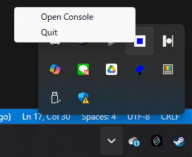
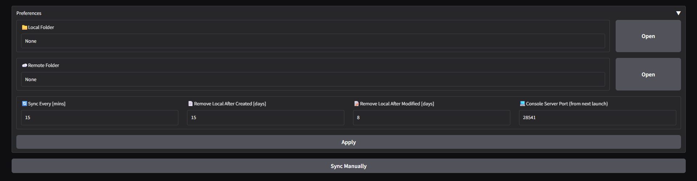
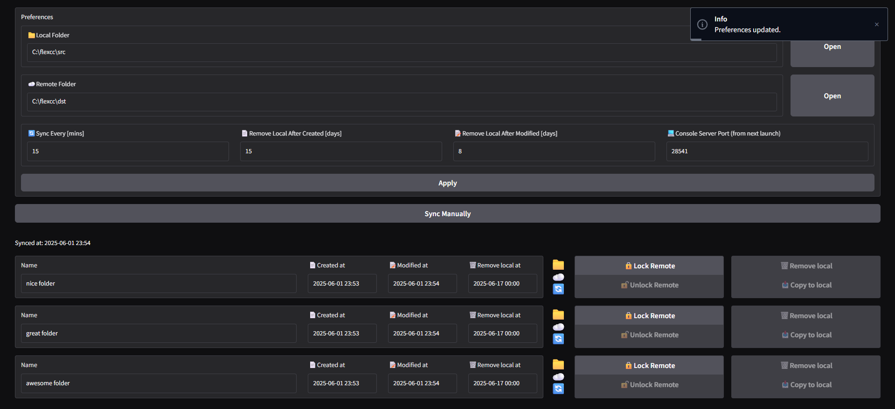

# flexcc

flexcc はローカルで動作するデータバックアップアプリケーションです。ローカルフォルダ、リモートフォルダのペアを指定して、ローカルフォルダのデータを自動的にリモートフォルダにバックアップします。

## Highlights

- ➡️**一方向同期**: 同期は常にローカル→リモートの方向で行われます。バックアップ先のファイルを削除することでローカルフォルダが破壊されることはありません
- ✏️**編集容易性**: ローカルフォルダの変更は自動的にリモートフォルダに反映されるため、常に高速なローカルフォルダの作業環境を利用できます
- 🗃️**省スペース**: フォルダ単位で同期のON/OFFが切り替えられ、更新が止まったローカルフォルダは自動的に削除されます。もちろんリモートフォルダから再度ダウンロードすることも可能です
- 🖥️**設定コンソール**: 各種設定はコンソールから編集することができます。コンソール上では設定変更の他にもフォルダごとの更新状況の確認や、リモートフォルダのロック・アンロックもできます

## Use Cases

**NASを利用した長期的なデータ保管**と**ローカルドライブによる高速なファイルアクセス**をバランスよく使い分けたいというニーズにフィットします。

### Examples

- RAW 現像
- DAW による楽曲制作
- イラストの制作
- 動画編集

## Installation

flexcc は Windows 専用アプリケーションです。また、アプリケーションの動作には `Python >= 3.13` および `uv` モジュールが必要です。

- [Python](https://www.python.org/downloads/)
- [uv](https://github.com/astral-sh/uv/tree/main)

Python および uv のセットアップが完了したら、github のメニューから `Download ZIP` を選択してダウンロードしたファイルを展開するか、CLI上で以下のコマンドを実行します。

```bash
git clone https://github.com/soymushroom/flexcc.git
```

アプリケーションフォルダが展開されたら、CLI上でそのフォルダに移動し、以下のコマンドで動作環境を設定します。

```bash
uv venv install
```

環境設定が完了したら、以下のコマンドで flexcc を起動します。

```bash
uv run app.py
```

アプリケーションが起動すると、タスクトレイにアイコンが追加されます。右クリックでメニューを開き `Open Console` を選択します。



規定のWebブラウザでコンソールが開くので、`📁Local Folder`, `☁️Remote Folder` の右にある `Open` ボタンを押して各フォルダを指定します。



`Apply` ボタンを押すと設定が反映され、ローカルフォルダからリモートフォルダへの同期が開始されます。



詳しい操作方法については [Documentation](#documentation) を参照してください。

## Documentation

作成中です。

## Features

作成中です。

## Platform support

Windows 専用アプリケーションです。詳細は Platform support ドキュメントを参照ください。

## Versioning policy

Versioning policy ドキュメントを参照ください。

## Contributing

私たちは、あらゆる経験レベルのコントリビューターを歓迎しており、あなたがこのプロジェクトに参加してくださることを心から願っています。まずは Contributing guide をご覧ください。

## FAQ

作成中です。

## Acknowledgements

作成中です。

## License

未設定です。現時点では個人的利用のみ許可します。