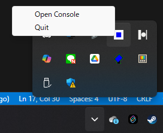
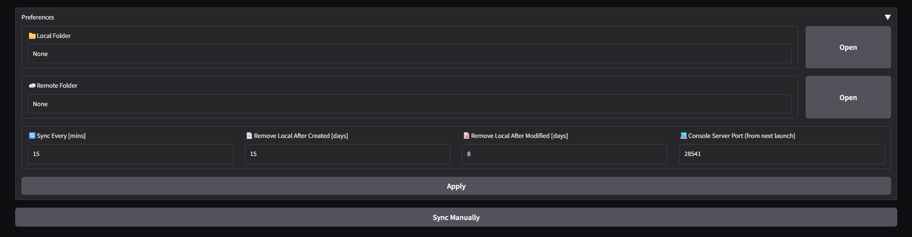
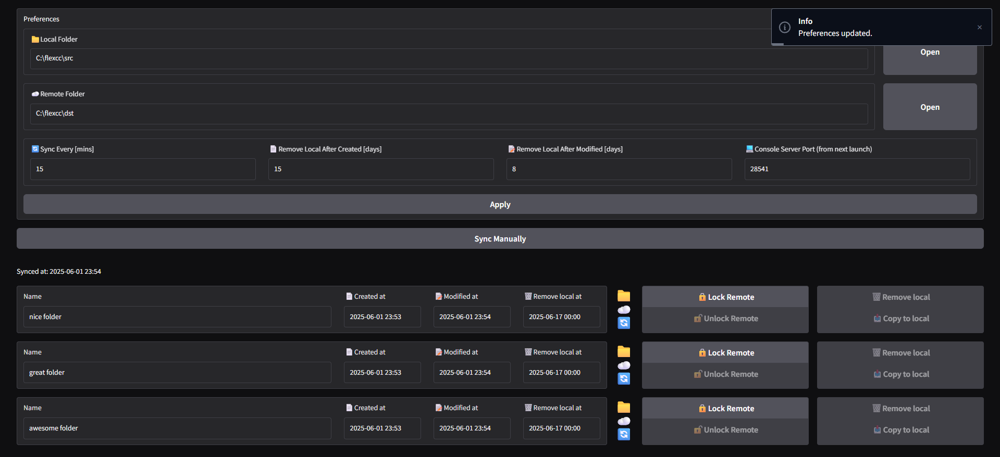

# flexcc

flexcc はローカルで動作するデータバックアップアプリケーションです。ローカルディレクトリ、リモートディレクトリのペアを指定して、ローカルディレクトリのデータを自動的にリモートディレクトリにバックアップします。

## Highlights

- ➡️ **一方向同期**: 同期は常にローカル→リモートの方向で行われます。バックアップ先のファイルを削除することでローカルディレクトリが破壊されることはありません
- ✏️ **編集容易性**: ローカルディレクトリの変更は自動的にリモートディレクトリに反映されるため、常に高速なローカルディレクトリの作業環境を利用できます
- 🗃️ **省スペース**: ディレクトリ単位で同期のON/OFFが切り替えられ、更新が止まったローカルディレクトリは自動的に削除されます。もちろんリモートディレクトリから再度ダウンロードすることも可能です
- 🖥️ **設定コンソール**: 各種設定はコンソールから編集することができます。コンソール上では設定変更の他にもディレクトリごとの更新状況の確認や、リモートディレクトリのロック・アンロックもできます

## Use cases

**NASなどのネットワークストレージを利用した長期・低速のデータ保管**と**ローカルストレージによる短期・高速のデータ編集**をバランスよく使い分けたいというニーズにフィットします。

### Examples

- 📷 写真データの編集
- 🎸 楽曲制作
- 🖼️ イラスト制作
- 🎞️ 動画編集

## Installation

flexcc は Windows 専用アプリケーションです。また、アプリケーションの動作には `Python >= 3.13` および `uv` モジュールが必要です。

- [Python](https://www.python.org/downloads/)
- [uv](https://github.com/astral-sh/uv/tree/main)

Python および uv のセットアップが完了したら、github のメニューから `Download ZIP` を選択してダウンロードしたファイルを展開するか、CLI上で以下のコマンドを実行します。

```bash
git clone https://github.com/soymushroom/flexcc.git
```

アプリケーションディレクトリが展開されたら、CLI上でそのディレクトリに移動します。CLIからリポジトリをクローンした場合は、以下のコマンドで移動します。

```bash
cd flexcc
```

アプリケーションディレクトリに移動したのち、以下のコマンドで動作環境を設定します。

```bash
uv sync
```

環境設定が完了するのを待ち、以下のコマンドで flexcc を起動します。

```bash
uv run app.py
```

アプリケーションが起動すると、タスクトレイにアイコンが追加されます。右クリックでメニューを開き `Open Console` を選択します。



規定のWebブラウザでコンソールが開くので、`📁Local Directory`, `☁️Remote Directory` の右にある `Open` ボタンを押して各ディレクトリを指定します。



`Apply` ボタンを押すと設定が反映され、ローカルディレクトリからリモートディレクトリへの同期が開始されます。



## Documentation

flexcc のドキュメントは https://soymushroom.github.io/flexcc で閲覧できます。

## Features

### One-way synchronization

ローカルディレクトリとリモートディレクトリの両方を指定すると、ローカルディレクトリの中にあるファイルはすべてリモートディレクトリにコピーされます。一定時間おきにファイルの追加や変更をチェックし、常に同期が取れた状態を保ちます。

### Auto storage management

ローカルディレクトリ内の各ディレクトリについて、一定期間内容に変更が加わらなかったものは自動的に削除されます。リモートディレクトリには完全なコピーが保管されているため、いつでもローカルディレクトリで作業を再開できます。

### Custom scripts

リモートディレクトリに同期されるファイルに対して、ユーザーが独自に設定したPythonスクリプトを実行することができます。特定の拡張子をもつファイルのみ別の場所にコピーしたり、画像ファイルを縮小して軽量化したものを別途保存することなどが可能になります。

## Platform support

Windows 専用アプリケーションです。詳細は [platform support](https://soymushroom.github.io/flexcc/reference/platform-support) ドキュメントを参照ください。

## License

flexcc は、以下のいずれかのライセンスのもとで提供されています（選択可能）：

- Apache License, Version 2.0
    - [LICENSE-APACHE](https://github.com/soymushroom/flexcc/blob/main/LICENSE-APACHE) | [https://www.apache.org/licenses/LICENSE-2.0](https://www.apache.org/licenses/LICENSE-2.0)
- MIT License
    - [LICENSE-MIT](https://github.com/soymushroom/flexcc/blob/main/LICENSE-MIT) | [https://opensource.org/licenses/MIT](https://opensource.org/licenses/MIT)

特に明示しない限り、あなたが flexcc に対して行った貢献（Apache-2.0 ライセンスで定義されるような、意図的に提出されたもの）は、上記のライセンスに基づいて二重ライセンスされ、追加の条件なしに適用されます。