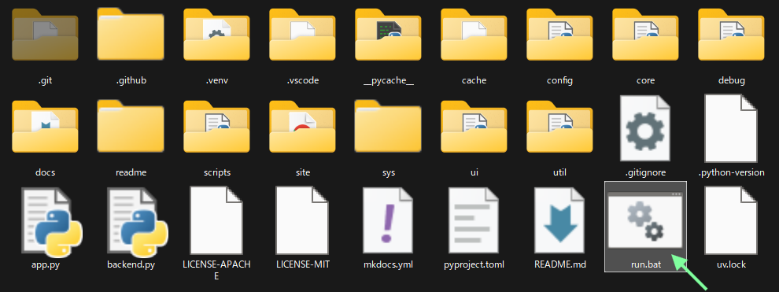
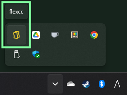
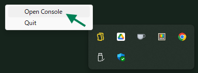
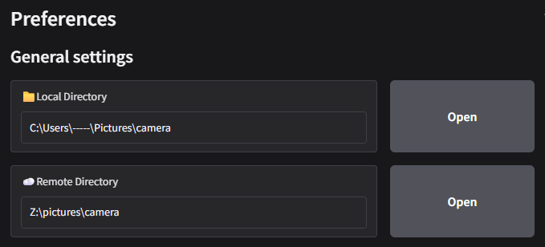
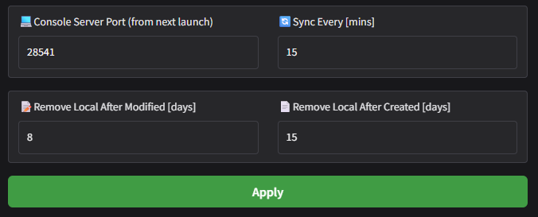

# First steps

フォルダの中にある `run.bat` をダブルクリックしてアプリを実行します。



??? note "CLI から起動するには"
    インストール先に移動して以下を実行します。

    ```bash
    uv run app.py
    ```

アプリケーションが起動すると、タスクトレイにアイコンが追加されます。右クリックでメニューを開き `Open Console` を選択します。

 

規定のWebブラウザでコンソールが開くので、`📁Local Directory`, `☁️Remote Directory` の右にある `Open` ボタンを押して各ディレクトリを指定します。



`Apply` ボタンを押すと設定が反映され、ローカルディレクトリからリモートディレクトリへの同期が開始されます。

