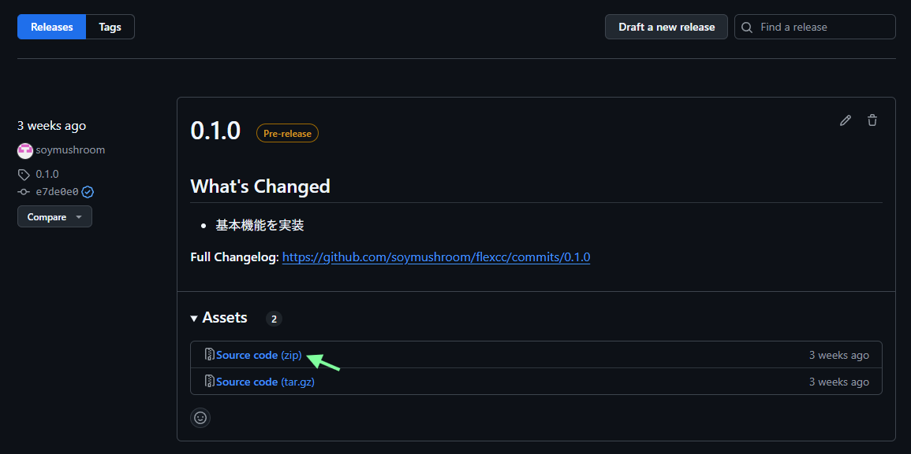
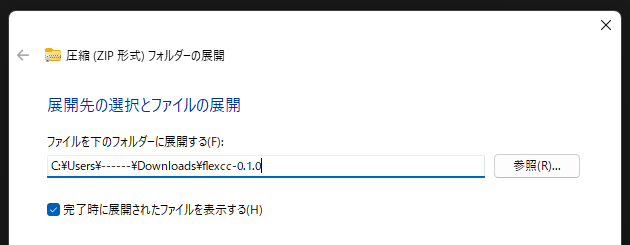

# Installation

!!! warning ""

    flexcc は Windows 専用アプリケーションです。

## Setup environment

flexcc の動作には `Python >= 3.13` および `uv` モジュールが必要です。以下のページを参考にインストールを実施してください。

- [Python](https://www.python.org/downloads/)
- [uv](https://docs.astral.sh/uv/)

## Install app

Python および uv のセットアップが完了したら flexcc のインストールおよびセットアップを実施します。簡単操作の [GUI](#__tabbed_1_1) と、扱い慣れた方向けの [CLI](#__tabbed_1_2) によるインストールをサポートしています。

=== "GUI"

    [こちら](https://github.com/soymushroom/flexcc/releases) から一番上のバージョンを選択して `Assets` > `Source code (zip)` をクリックします。

    

    ダウンロードが完了したら、ZIP ファイルを展開してディレクトリを開きます。

    

    ディレクトリの中にある `run.bat` をダブルクリックしてアプリを実行します。

    

=== "CLI"

    リポジトリをクローンします。

    ```bash
    git clone https://github.com/soymushroom/flexcc.git
    ```

    リポジトリ内に移動します。

    ```bash
    cd flexcc
    ```

    動作環境を設定します。

    ```bash
    uv sync
    ```

    flexcc を起動します。

    ```bash
    uv run app.py
    ```
