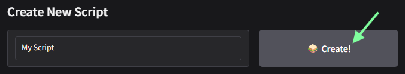
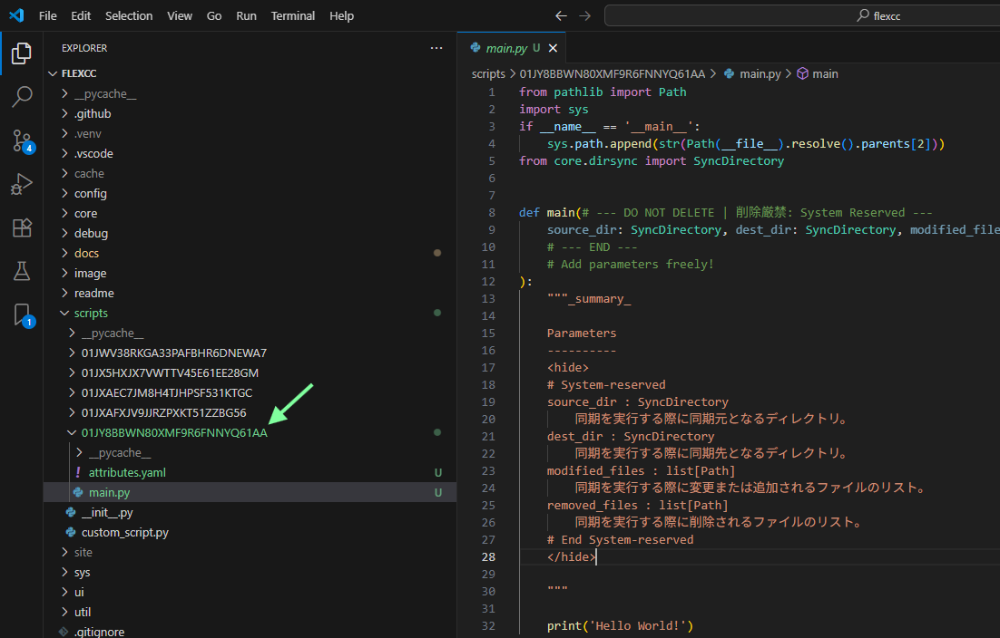
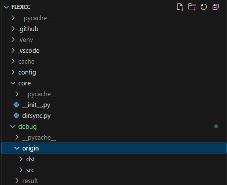
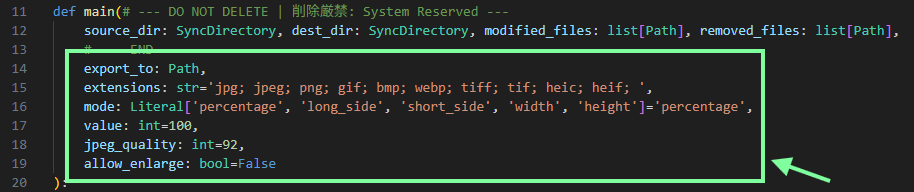
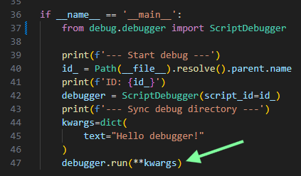
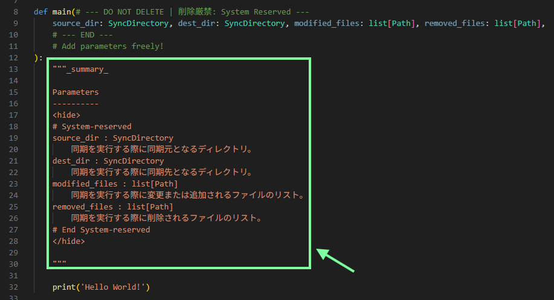
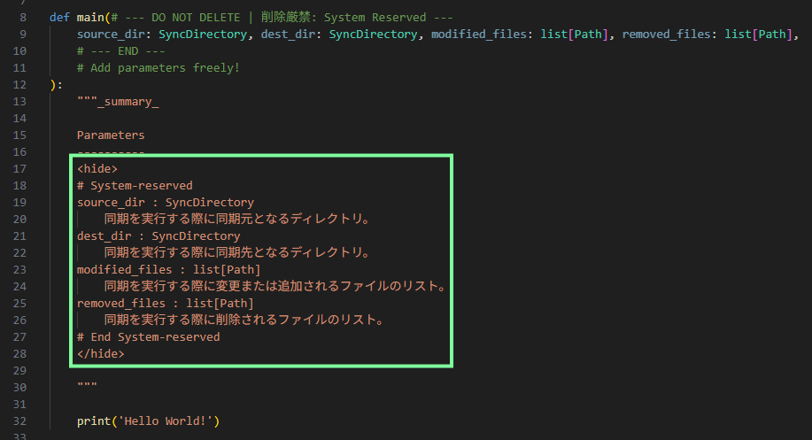
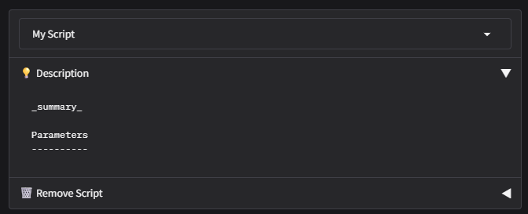

# Dev scripts

flexcc のスクリプト実行では、ユーザーが独自に実装したスクリプトを呼び出すことも可能です。

## Create script

コンソールのメニューから `Create new script` のテキストボックスにスクリプト名を設定し、`🥪Create!` ボタンをクリックします。




スクリプトが生成されると `Create new script` 下部の `Script finder` に生成されたスクリプトのパスが表示されます。


表示されたパスには以下のファイルがあります。必要に応じて編集してください。

- `attributes.yaml`: スクリプト名や制作者名、バージョン等の属性が記録されています。
- `main.py`: スクリプトの本体です。


## Edit script

以下ではコードエディタ [Visual Studio Code (VSCode)](https://code.visualstudio.com/){target=_blank} での開発手順について説明します。

flexcc のディレクトリを開くと Script finder で確認したスクリプトのパスが追加されているので、そこにある `main.py` を開きます。



このスクリプトは直接呼出しによる動作をサポートしており、Python Debugger によるデバッグ実行が可能です。

## Run with debugger

スクリプトの `main.py` を直接呼び出した場合は、デバッグ用の同期タスクが実行されます。デバッグディレクトリ `debug/origin` が `debug/result` として複製され、以下の構成で同期を開始します。

- ローカルディレクトリ: `debug/result/src`
- リモートディレクトリ: `debug/result/dst`

!!! note
    デバッグディレクトリの詳細な構成については `debug/origin` の内容を参照してください。

    

アプリ本体からの呼び出し時、デバッグ実行時ともに `main` 関数が実行され、以下の引数がシステムから自動で取得されます。

- `source_dir`: 同期元になるディレクトリ（専用クラス、デバッグ時は `debug/result/src` から生成）
- `dest_dir`: 同期先になるディレクトリ（専用クラス、デバッグ時は `debug/result/dst` から生成）
- `modified_files`: 同期元で編集・追加されたファイルパスのリスト
- `removed_files`: 同期元で削除されたファイルパスのリスト

!!! note
    `modified_files`, `removed_files` に含まれるパスは同期ディレクトリを基準とした相対パスです。各ディレクトリに保存したファイルにアクセスしたい場合は以下のように記載してください。

    ```Python
    # modified files in source directory
    for p in modified_files:
        file_path = source_dir.path_ / p
        print(file_path)

    # files to be removed in destination directory
    for p in removed_files:
        file_path = dest_dir.path_ / p
        print(file_path)
    ```

## Add parameters

追加で定義された引数はコンソール上で設定可能なパラメータになります。引数の型に応じて適切なコンポーネントが選択されます。



!!! info "対応している型"

    - **str**: テキストボックス
    - **int**: 数値（整数のみ）
    - **float**: 数値（実数）
    - **bool**: チェックボックス
    - **datetime**: カレンダー
    - **Path**: ダイアログ（ファイル | ディレクトリ）
    - **Literal**: ドロップダウン

デバッグ実行の際にパラメータを指定したい場合は、`ScriptDebugger.run` の引数として指定してください。



!!! note
    `ScriptDebugger` クラスにはデバッグ用のバックアップ先として
    ```Python
    ScriptDebugger.BACKUP_DIR = pathlib.Path(debug/result/bak)
    ```
    が登録されています。必要に応じて利用ください。

## Edit description

関数にdocstringを記入すると、コンソール上でスクリプトを選択した際の `Description` 欄に表示されます。



!!! note
    `<hide>`, `</hide>` のタグで囲まれたテキストはコンソール上で非表示になります。

    

    