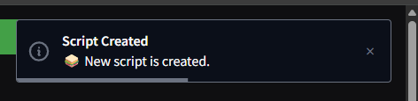
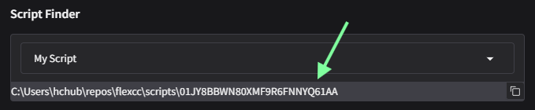
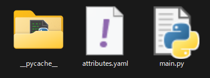

# Dev scripts

flexcc のスクリプト実行では、ユーザーが独自に実装したスクリプトを呼び出すことも可能です。

コンソールのメニューから `Create new script` のテキストボックスにスクリプト名を設定し、`🥪Create!` ボタンをクリックします。

スクリプトが生成されると `Create new script` 下部の `Script finder` に生成されたスクリプトのパスが表示されます。

表示されたパスには以下のファイルがあります。必要に応じて編集してください。

- `attributes.yaml`: スクリプト名や制作者名、バージョン等の属性が記録されています。
- `main.py`: スクリプトの本体です。

以下ではコードエディタ [Visual Studio Code (VSCode)](https://code.visualstudio.com/){target=_blank} での開発手順について説明します。