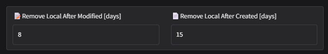
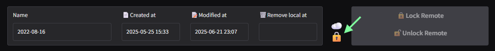
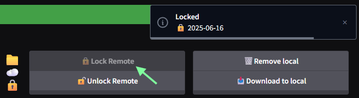
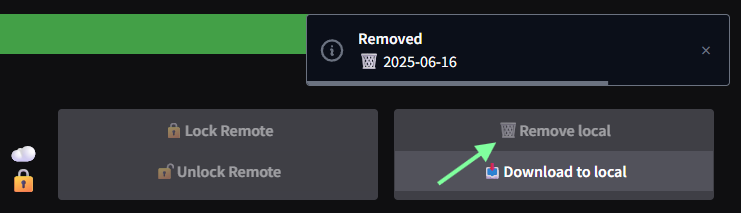
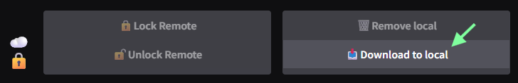
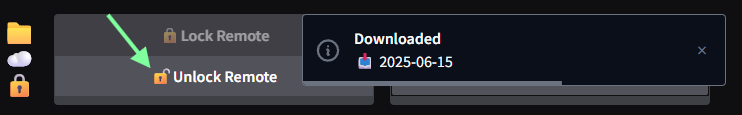

# Managing storage

flexcc は日常的に利用するストレージが圧迫されないよう、一定期間変更が加わっていないローカルディレクトリを自動的に削除します。

## Auto-removing criteria

削除の条件は2つあり、**最後にローカルディレクトリへ変更が加わってからの経過日数** と **ローカルディレクトリが作成されてからの経過日数** の両方が基準日数を超えた場合にローカルディレクトリが削除されます。これらの日数は `Preferences` > `General settings` から変更可能です。

## Locking remote directories

ローカルディレクトリが削除される際、リモートディレクトリは自動的に **ロック** されます。ロックされたリモートディレクトリは同期が実行されなくなります。

!!! note
    ローカルディレクトリの削除中に同期が実行され、リモートディレクトリのファイルが削除されてしまうのを防ぐためです。

## Removing local directories

ローカルディレクトリは手動で削除することもできます。コンソールから `Lock Remote` ボタンをクリックしてリモートディレクトリをロックしてから、`Remove Local` ボタンをクリックします。

!!! warning
    ローカルディレクトリの削除は **必ず** コンソール上で行ってください。リモートディレクトリをロックしないままローカルディレクトリを削除すると、リモートディレクトリが破損する可能性があります。

## Restoring local directories

flexcc ではリモートディレクトリに長期保管しているデータをすぐに同期状態に戻すことができます。削除されたローカルディレクトリをもう一度利用するには、`Download Remote` ボタンをクリックしてください。ローカルディレクトリが元の場所にダウンロードされ、再び編集できるようになります。

!!! warning
    リモートディレクトリのダウンロードは **必ず** コンソール上で行ってください。リモートディレクトリをロックしないままローカルディレクトリにコピーすると、リモートディレクトリが破損する可能性があります。

ダウンロードが完了した後は、忘れずにリモートのロックを解除して同期が実行されるようにしてください。

!!! note
    リモートディレクトリのロックを解除する前にはローカルディレクトリを参照し、ファイルのダウンロードが正常に完了していることを確認してください。