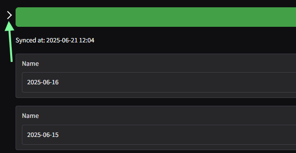
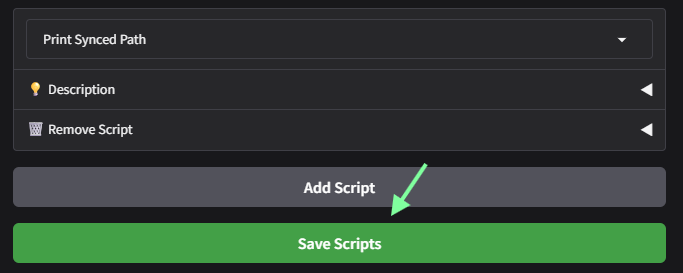

# Running scripts

flexcc では同期対象になったファイル群に対して、任意の Python スクリプトを適用することができます。

コンソール左側のメニューにある `Custom scripts` から `Add script` ボタンをクリックしてスクリプトを追加します。

!!! note
    画面上にメニューがない場合は、左上の `>` ボタンをクリックします。

    

スクリプトが追加されたら、ドロップダウンから必要なスクリプトを選択します。

!!! tip
    `Description` 欄にはスクリプトの概要とパラメータの解説が記載されています。

    

スクリプトによっては動作時のパラメータが設定できるものがあります。`Description` 欄を参照しながら、所望のパラメータをセットします。

スクリプトが不要になった場合は、`Remove script` から `Remove` ボタンをクリックします。

スクリプトの選択とパラメータの選択が完了したら、`Save script` ボタンをクリックして変更を確定します。

