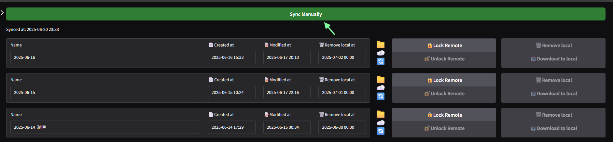
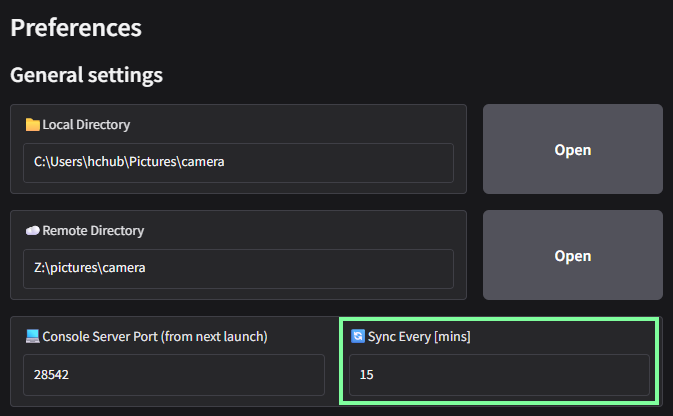
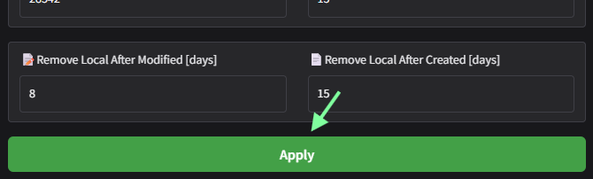
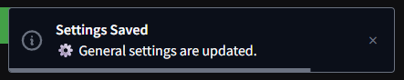

# Sync directories

flexcc の起動中は一定時間ごとに同期が実行されますが、コンソール上部のボタンをクリックすることで即座に同期を開始することができます。

!!! warning
    ローカルディレクトリからリモートディレクトリへの同期には **ファイルの削除も含まれます。** バックアップしておきたいファイルは必ずローカルディレクトリに残しておいてください。
    
    リモートディレクトリを残したままローカルディレクトリを削除する方法については、[managing storage](./managing-storage.md) を参照してください。

コンソール左側の設定画面から、`Sync Every` の値を変更することで、定期的に同期を実行する間隔を変更することができます。

設定が完了したら `Apply` ボタンをクリックして変更を確定します。設定が正常に保存された場合はダイアログが表示されます。

